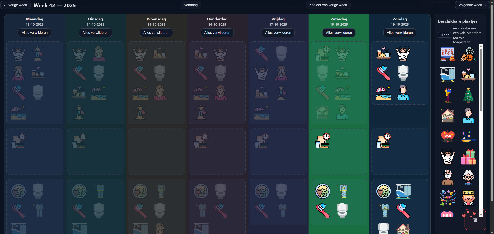

# 📅 Weekly Calendar with Images

A simple, touch-friendly weekly calendar that lets you drag and drop images into days and time slots.  
Designed to make daily and weekly planning more visual and intuitive — especially helpful for people with cognitive or physical disabilities.

---

## ✨ Features

- Drag and drop images into days and time slots (touchscreen supported).  
- Three time slots per day (morning, afternoon, evening).  
- Minimum of three images per time slot.  
- Move images between time slots or days.  
- Delete images by dragging them into the trash bin.  
- Click an image to make it semi-transparent — useful for visually marking or “checking off” completed tasks.  
- Console logging for all actions (day, time slot, image name).  
- Runs locally using PHP and JavaScript.

---

## 🧩 Installation

1. Clone or download this repository:  
   ```bash
   git clone https://github.com/<your-username>/<your-repo-name>.git
   ```

2. Place the folder on your local or external web server (for example, via Samba).  

3. Make sure PHP is installed and running on the server.  

4. Open the page in your browser, for example:  
   ```
   http://localhost/calendar/
   ```

5. Add your own images to the `images/` folder.

---

## 🛠️ Technology

- **Frontend:** HTML, CSS, JavaScript (drag & drop + touchscreen support)  
- **Backend:** PHP (for file management and logic)  

---

## 🧑‍💻 Contributing

Contributions are very welcome!  
- Improve accessibility (e.g. ARIA support, keyboard navigation).  
- Optimize the code or add new features.  
- Submit a pull request with a clear description of your changes.  

By contributing, you agree to the terms of the **AGPLv3 license**.

---

## ⚖️ License

This project is licensed under the **GNU Affero General Public License v3.0 (AGPLv3)**.  
See the [`LICENSE`](LICENSE) file for details.

---

## 💬 Contact

Author: **Roy Selten**  
Have ideas or want to help improve the project?  
Open an issue or reach out via GitHub.

## Screenshot

